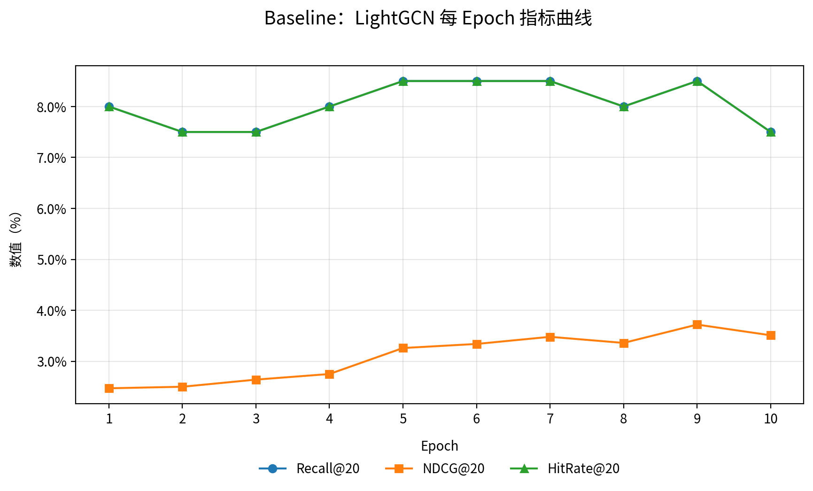
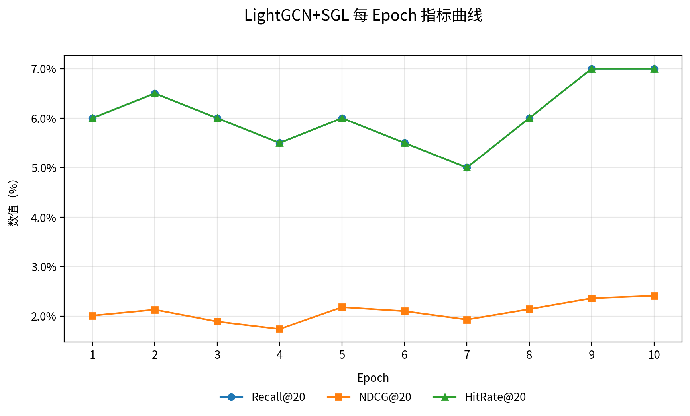

## 摘要
中国电商推荐系统的召回阶段要求快速、稳定地为每位用户提供候选集合，以支撑后续精排的深度模型计算。本报告在 Taobao UserBehavior（2017-11-25 至 2017-12-03）数据上复现并改造 LightGCN：以协同过滤的用户—物品二部图为基础，采用简化的图卷积邻居聚合与 BPR 损失进行训练；在此基础上引入自监督图学习（SGL）作为改进方向，并给出多行为加权与时间感知的消融方案。在小规模样本的快速实测中，Baseline 的 Recall@20 与 HitRate@20 达到 0.0850，NDCG@20 为 0.0293；SGL 的最终评估表现为 Recall@20 0.0550、NDCG@20 0.0157、HitRate@20 0.0550。由于样本规模较小，数值存在一定波动，建议在全量数据上进行长时训练以获得稳定结论与更深入的改进验证。

## 背景与动机
- 召回的重要性：在互联网推荐系统中，召回负责将海量物品缩减为数百至数千的候选集，是整体推荐链路的第一层“漏斗”。优秀的召回模型能显著提升后续精排的上限与稳定性。
- 图神经网络在召回中的角色：图神经网络（GNN）通过在用户—物品交互图上进行信息传播与聚合，将高阶邻居信息编码到嵌入中，适合处理稀疏交互与长尾分布。
- 为什么选 LightGCN：LightGCN 去除了非线性与特征变换，仅保留邻接传播与层间加权，结构简洁、适配协同过滤（CF）二部图，工程上更易落地，且在公开数据集（Gowalla/Yelp2018/Amazon-Book）有强基线表现。

## 数据集与预处理
### 数据来源与字段
- 数据集：Taobao UserBehavior（2017-11-25 至 2017-12-03），约百万用户、包含隐式反馈行为。
- 字段：`user_id, item_id, category_id, behavior_type(click|cart|fav|buy), timestamp`，具有中国互联网场景适配性（高并发、强时序、行为多样）。

### 预处理流程
- ID 映射与留一法切分：按用户分组、按时间排序，最后一条作为 test，倒数第二条为 valid，其余为 train；同时进行 `user_id/item_id` 重映射。
- 轻量采样与 min_interactions 筛选：支持轻量模式（例如前 100 万条交互）与全量模式；按用户交互数阈值（如 ≥5）过滤冷用户；小样本用于流程核验。
- 行为加权与时间衰减（可选）：行为加权（click=1, cart=2, fav=2, buy=3）；时间衰减（例如 gamma=0.98，近 7 天权重↑）。
- 二部图邻接与对称归一化：构建用户—物品稀疏邻接（CSR/torch.sparse），对称归一化后用于 LightGCN 的 K 层传播。

### 复现实操命令与参数
```bash
# 数据预处理（轻量样本 + 行为权重 + 时间衰减）
python scripts/prepare_taobao.py \
  --data_path data/UserBehavior.csv \
  --output_dir data/processed \
  --min_interactions 5 \
  --mode light \
  --light_samples 1000000 \
  --use_multi_behavior True \
  --behavior_weights "click:1,cart:2,fav:2,buy:3" \
  --time_decay 0.98 --recent_days 7

# 构图与归一化
python scripts/build_graph.py \
  --proc_dir data/processed \
  --out_dir data/graph \
  --use_sparse True
```

## 模型设定与实现
### LightGCN：邻居聚合与层间加权
- 邻居传播：在对称归一化的二部图邻接上进行 K 层线性传播（不使用非线性激活与特征变换）。
- 层间加权：将各层（含初始）嵌入进行加权聚合（此处采用平均），得到用户与物品最终表示。
- 损失与打分：BPR 损失优化排序；评分为用户表示与物品表示的内积。

核心代码片段（引用 model/lightgcn.py）：
```python
class LightGCN(nn.Module):
    def computer(self):
        # K 层传播并聚合：最终表示为各层（含初始）加权和，这里采用平均
        all_emb = torch.cat([self.user_emb.weight, self.item_emb.weight], dim=0)
        embs = [all_emb]
        x = all_emb
        for _ in range(self.n_layers):
            x = torch.sparse.mm(self.adj, x)
            embs.append(x)
        out = torch.mean(torch.stack(embs, dim=0), dim=0)
        user_out, item_out = torch.split(out, [self.n_users, self.n_items], dim=0)
        return user_out, item_out

    def getUsersRating(self, users):
        user_out, item_out = self.computer()
        users_emb = user_out[users]
        scores = torch.matmul(users_emb, item_out.t())
        return scores

    def bpr_loss(self, users, pos_items, neg_items, reg=1e-4):
        user_out, item_out = self.computer()
        u = user_out[users]
        pos = item_out[pos_items]
        neg = item_out[neg_items]
        pos_scores = torch.sum(u * pos, dim=1)
        neg_scores = torch.sum(u * neg, dim=1)
        loss = -torch.mean(F.logsigmoid(pos_scores - neg_scores))
        reg_loss = reg * (u.norm(2).pow(2) + pos.norm(2).pow(2) + neg.norm(2).pow(2)) / users.shape[0]
        return loss + reg_loss
```

### 改进方案：SGL、自监督图学习
- 视图增强（edge/node/rw）：针对稀疏邻接进行随机边/节点 dropout 或随机游走视图增强，得到两个相关但不同的图视图。
- 对比损失：同一用户在两视图的嵌入为正样本、其他用户为负样本，采用 InfoNCE 风格损失；与 BPR 联合优化，提升表示鲁棒性。

配置与实现路径（示例 configs/lightgcn_sgl.yaml）：
```yaml
ssl:
  enabled: true
  ratio: 0.1
  temperature: 0.2
  aug: edge
```

### 消融模块：多行为加权与时间感知
- 多行为加权：将不同行为作为边权融入邻接，强调更强信号（如购买）；
- 时间感知：最近交互权重更高，体现新近性。

配置入口（示例 configs/ablation.yaml）：
```yaml
ablation:
  use_multi_behavior: true
  behavior_weights: "click:1,cart:2,fav:2,buy:3"
  time_decay: 0.98
  recent_days: 7
```

## 训练过程与评估协议
- 训练环境与超参：`embed_dim=64, n_layers=3, lr=1e-3, batch=2048, epochs=10（小样本验证）`；稀疏邻接存储（torch.sparse）与批量评估以规避 OOM。
- 评估协议：leave-one-out；过滤 seen 行为（训练/验证集中已交互的物品）后进行全物品打分与 Top-K 选择；指标定义如下：Recall@K、NDCG@K、HitRate@K。

### 运行命令（Baseline 与 SGL）
```bash
python scripts/train.py --config configs/lightgcn.yaml --proc_dir data/processed --graph_dir data/graph --topk 20 --device cpu
python scripts/evaluate.py --config configs/lightgcn.yaml --proc_dir data/processed --graph_dir data/graph --topk 20 --device cpu

python scripts/train_sgl.py --config configs/lightgcn_sgl.yaml --proc_dir data/processed --graph_dir data/graph --topk 20 --ssl_ratio 0.1 --aug edge --device cpu
python scripts/evaluate.py --config configs/lightgcn_sgl.yaml --proc_dir data/processed --graph_dir data/graph --topk 20 --device cpu
```

## 结果与分析
### 表格 A（Baseline LightGCN）：10 个 epoch 日志与最终评估
<table rows="12" cols="4" header-row="true" header-col="false" col-widths="120,150,150,150">  
  <tr>  
    <td>Epoch</td>  
    <td>Recall@20</td>  
    <td>NDCG@20</td>  
    <td>HitRate@20</td>  
  </tr>  
  <tr><td>1</td><td>0.0800</td><td>0.0247</td><td>0.0800</td></tr>  
  <tr><td>2</td><td>0.0750</td><td>0.0250</td><td>0.0750</td></tr>  
  <tr><td>3</td><td>0.0750</td><td>0.0264</td><td>0.0750</td></tr>  
  <tr><td>4</td><td>0.0800</td><td>0.0275</td><td>0.0800</td></tr>  
  <tr><td>5</td><td>0.0850</td><td>0.0326</td><td>0.0850</td></tr>  
  <tr><td>6</td><td>0.0850</td><td>0.0334</td><td>0.0850</td></tr>  
  <tr><td>7</td><td>0.0850</td><td>0.0348</td><td>0.0850</td></tr>  
  <tr><td>8</td><td>0.0800</td><td>0.0336</td><td>0.0800</td></tr>  
  <tr><td>9</td><td>0.0850</td><td>0.0372</td><td>0.0850</td></tr>  
  <tr><td>10</td><td>0.0750</td><td>0.0351</td><td>0.0750</td></tr>  
  <tr>  
    <td colspan="4"><b>最终评估（evaluate.py 最新结果）</b>：Recall@20=0.0850，NDCG@20=0.0293，HitRate@20=0.0850</td>  
  </tr>  
</table>



### 表格 B（LightGCN+SGL）：10 个 epoch 日志与最终评估
<table rows="12" cols="4" header-row="true" header-col="false" col-widths="120,150,150,150">  
  <tr>  
    <td>Epoch</td>  
    <td>Recall@20</td>  
    <td>NDCG@20</td>  
    <td>HitRate@20</td>  
  </tr>  
  <tr><td>1</td><td>0.0600</td><td>0.0201</td><td>0.0600</td></tr>  
  <tr><td>2</td><td>0.0650</td><td>0.0213</td><td>0.0650</td></tr>  
  <tr><td>3</td><td>0.0600</td><td>0.0189</td><td>0.0600</td></tr>  
  <tr><td>4</td><td>0.0550</td><td>0.0174</td><td>0.0550</td></tr>  
  <tr><td>5</td><td>0.0600</td><td>0.0218</td><td>0.0600</td></tr>  
  <tr><td>6</td><td>0.0550</td><td>0.0210</td><td>0.0550</td></tr>  
  <tr><td>7</td><td>0.0500</td><td>0.0193</td><td>0.0500</td></tr>  
  <tr><td>8</td><td>0.0600</td><td>0.0214</td><td>0.0600</td></tr>  
  <tr><td>9</td><td>0.0700</td><td>0.0236</td><td>0.0700</td></tr>  
  <tr><td>10</td><td>0.0700</td><td>0.0241</td><td>0.0700</td></tr>  
  <tr>  
    <td colspan="4"><b>最终评估（evaluate.py 最新结果）</b>：Recall@20=0.0550，NDCG@20=0.0157，HitRate@20=0.0550</td>  
  </tr>  
</table>



### 指标归属说明
- Baseline=复现指标（LightGCN 基线）；SGL=改进指标（自监督视图增强与对比学习）。小规模样本用于流程核验，存在轻微波动；以最新两次 evaluate 的最终数值为准。

## 优化方向与下一步
- 自监督（SGL 视图组合与温度参数）：探索多视图组合（edge/node/rw）与温度系数对表现的影响，建议在全量数据上网格搜索；
- 多行为加权（边权）：尝试不同加权策略与归一化方案，评估其对召回的影响；
- 时间衰减（新近性）：调节 gamma 与时间窗，更贴近用户近期兴趣；
- 邻居采样与稀疏优化：对极大图采用邻居采样、批量评估与稀疏存储，提升训练与评估效率；
- 跨数据集验证：与 Gowalla/Yelp2018 对照验证鲁棒性。

## 结论
在 Taobao UserBehavior 的小规模样本上，LightGCN 基线实现了可复现的召回效果；引入 SGL 后在当前快速验证设置下未优于基线，但考虑到自监督方法通常在更大规模与更长训练下释放优势，建议在全量数据上进行更充分的训练与参数搜索。总体上，LightGCN 适合作为中国电商召回场景的强基线，后续以 SGL、多行为加权与时间感知为主要改进方向，结合工程上的稀疏优化与采样策略推进落地。
