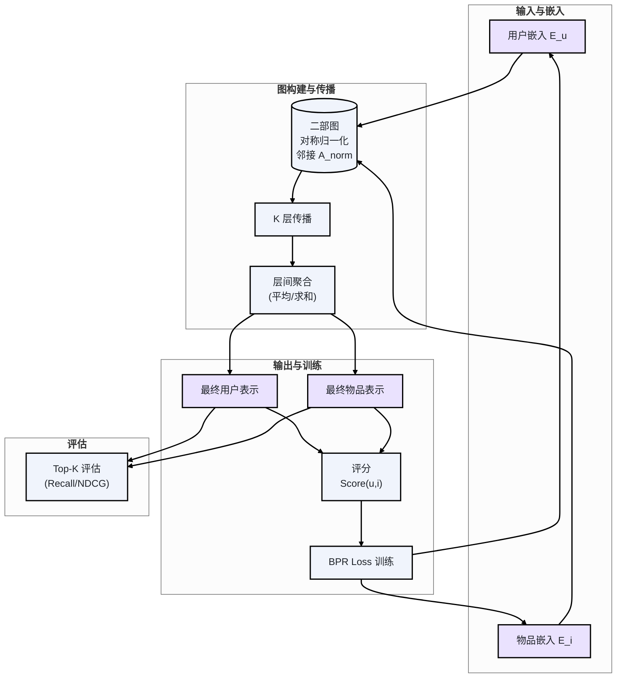
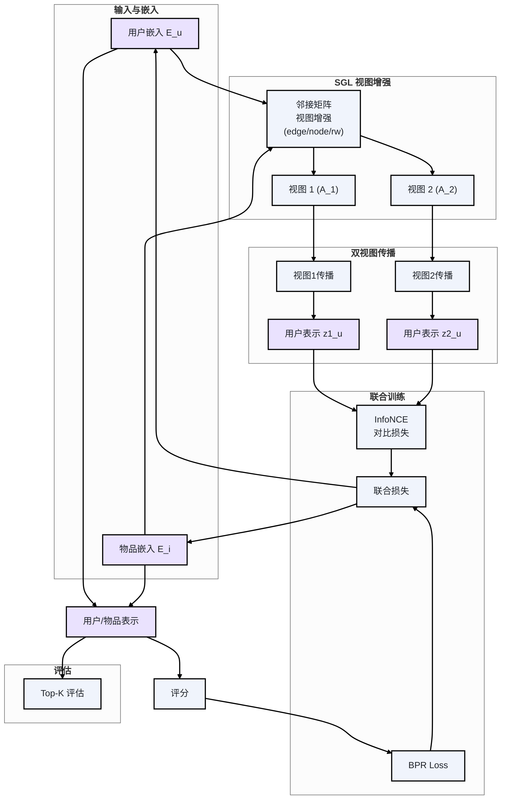

## 模型结构白板示意

### Baseline: LightGCN

```mermaid
---
config:
  theme: 'neutral'
---
flowchart TD
    linkStyle default stroke-width:2px,stroke:#000000

    classDef startend_style fill:#EAE2FE,stroke:#000000,stroke-width:2px,color:#1f2329
    classDef process_style fill:#F0F4FC,stroke:#000000,stroke-width:2px,color:#1f2329
    classDef decision_style fill:#FEF1CE,stroke:#000000,stroke-width:2px,color:#1f2329
    classDef subgraph_style fill:#f5f5f5,stroke:#bbbfc4,stroke-width:1px,color:#000000

    subgraph "`**输入与嵌入**`"
        U["用户嵌入 E_u"]
        I["物品嵌入 E_i"]
    end

    subgraph "`**图构建与传播**`"
        A[("二部图<br>对称归一化<br>邻接 A_norm")]
        L1["K 层传播"]
        L2["层间聚合<br>(平均/求和)"]
    end

    subgraph "`**输出与训练**`"
        U_out["最终用户表示"]
        I_out["最终物品表示"]
        Score["评分<br>Score(u,i)"]
        BPR["BPR Loss 训练"]
    end
    
    subgraph "`**评估**`"
        Eval["Top-K 评估<br>(Recall/NDCG)"]
    end

    U --> A
    I --> A
    A --> L1
    L1 --> L2
    L2 --> U_out
    L2 --> I_out
    U_out --> Score
    I_out --> Score
    Score --> BPR
    BPR --> U
    BPR --> I
    U_out --> Eval
    I_out --> Eval

    class U,I,U_out,I_out startend_style
    class A,L1,L2,Score,BPR,Eval process_style
```

### 改进: LightGCN+SGL

```mermaid
---
config:
  theme: 'neutral'
---
flowchart TD
    linkStyle default stroke-width:2px,stroke:#000000

    classDef startend_style fill:#EAE2FE,stroke:#000000,stroke-width:2px,color:#1f2329
    classDef process_style fill:#F0F4FC,stroke:#000000,stroke-width:2px,color:#1f2329
    classDef decision_style fill:#FEF1CE,stroke:#000000,stroke-width:2px,color:#1f2329
    classDef subgraph_style fill:#f5f5f5,stroke:#bbbfc4,stroke-width:1px,color:#000000

    subgraph "`**输入与嵌入**`"
        U["用户嵌入 E_u"]
        I["物品嵌入 E_i"]
    end

    subgraph "`**SGL 视图增强**`"
        Aug["邻接矩阵<br>视图增强<br>(edge/node/rw)"]
        View1["视图 1 (A_1)"]
        View2["视图 2 (A_2)"]
    end

    subgraph "`**双视图传播**`"
        Prop1["视图1传播"]
        Prop2["视图2传播"]
        Z1["用户表示 z1_u"]
        Z2["用户表示 z2_u"]
    end

    subgraph "`**联合训练**`"
        InfoNCE["InfoNCE<br>对比损失"]
        BPR["BPR Loss"]
        Loss["联合损失"]
    end
    
    subgraph "`**评估**`"
        Eval["Top-K 评估"]
    end

    U --> Aug
    I --> Aug
    Aug --> View1
    Aug --> View2
    View1 --> Prop1
    View2 --> Prop2
    Prop1 --> Z1
    Prop2 --> Z2
    Z1 --> InfoNCE
    Z2 --> InfoNCE
    
    U_main["用户/物品表示"]
    Score["评分"]
    
    U --> U_main
    I --> U_main
    U_main --> Score
    Score --> BPR
    
    InfoNCE --> Loss
    BPR --> Loss
    Loss --> U
    Loss --> I
    
    U_main --> Eval

    class U,I,Z1,Z2,U_main startend_style
    class Aug,View1,View2,Prop1,Prop2,InfoNCE,BPR,Loss,Score,Eval process_style
```
